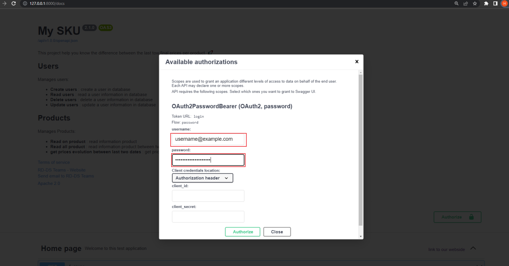

**Objectif**  
Délivrer un service via une API REST qui reçoit en paramètre une liste d'identifiants produits et qui retourne un json contenant la pour chaque produit en entrée la variation de prix entre les 2 dernières dates présentes dans le fichier.  

Nous allons lancer l’application afin de pouvoir manipuler cette api pour avoir les données dont on a besoin. Nous avont créer plusieurs endpoint qui permettrons de manipuler la donnée.


**Prérequis**:  
Pour exécuter cette application, nous avons besoin d'avoir:
- docker desktop et docker-compose installé sur son poste,
- un compte github pour récupérer les données et jouer les tests unitaires


**initialisation et lancement de l'application**:  
- il faut cloner le repos git sur son poste en local
- il faut ouvrir docker desktop et s’assurer qu’il est en mode running
- il faut ouvrir une invite de commande (cmd: Windows / Terminal: Linux ou MacOs) et se placer à la racine du projet cloné

- On peut déjà voir la liste des containers. Dans un terminal, jouez la commande suivante
    ```
    docker container ls -a
    ```

- On lance un docker-compose qui buildera l’image de l’application et créera deux bases de données (app et test)
    ```
    docker-compose -f docker-compose.yaml up --build
    ```
  

- PS: En production le fichier configuration.yaml sera monté en volume dans le docker compose et certain fichier notamment le dossier Test sera a ignorer dans le fichier .dockerignore

- il faut se rassurer que les trois services sont bien en RUNNING sur l’application docker desktop
  - sku-api-ctnr 
  - pg-api-app-ctnr 
  - pg-api-test-ctnr 
  

- Pour vérifier que tout à bien marché, allez sur un navigatuer et taper l'URL suivante http://127.0.0.1:8000/docs/ et vous auriez une page qui s'affiche sans erreur
  
**Authentification**
- cliquer sur cette icone et identifiez vous (une pop up s'ouvrira) avec les infos qui vous seront fourni par demande à l'adresse suivante `hermann.siebenou@hotmail.com` 
  
  

**Launch endpoint**
- Pour les lancements des endpoints, nous allons utiliser Swagger. Vous pourvez aussi utiliser `Postman` si vous le souhaitez 
  
  
  
  
